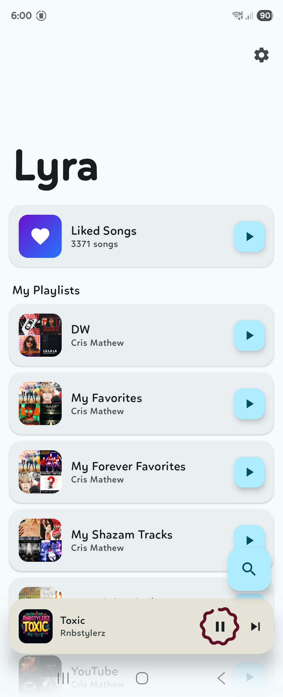
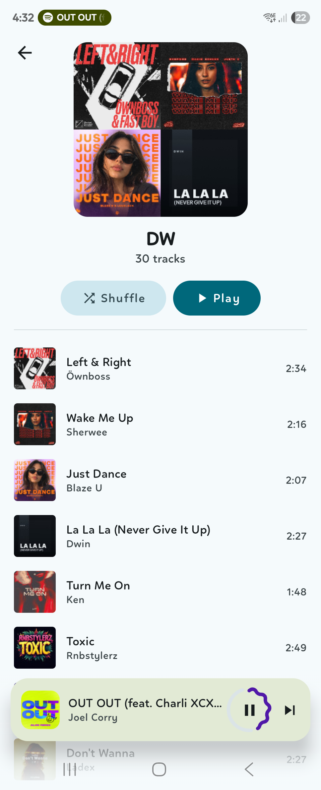
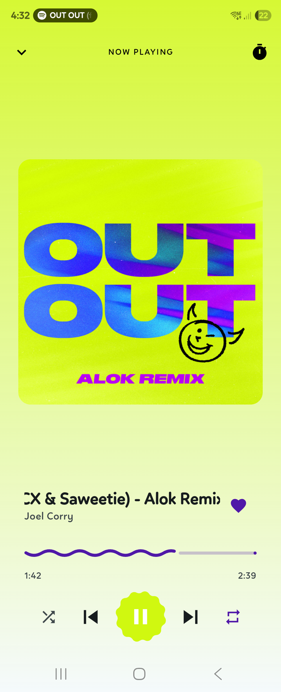
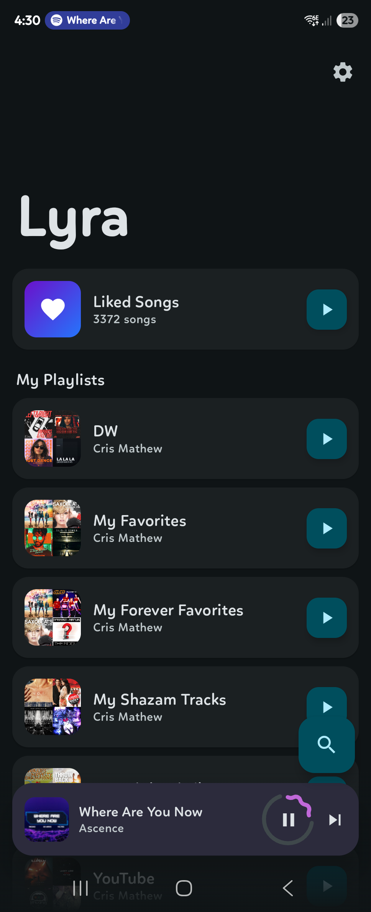
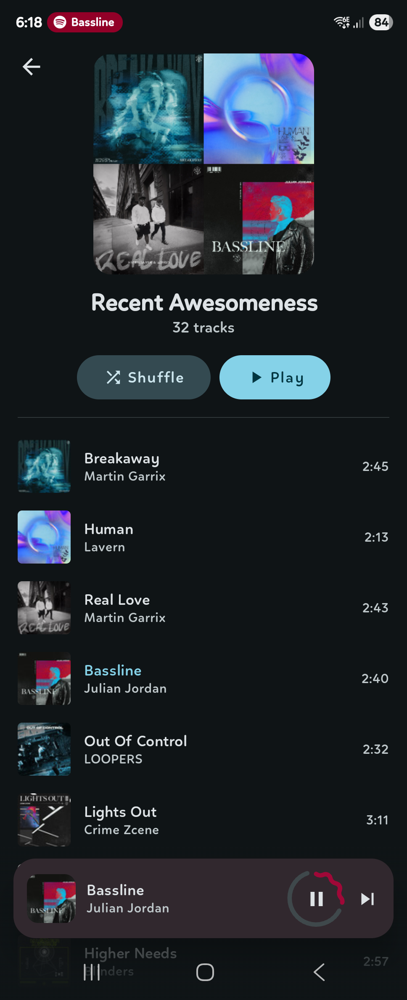
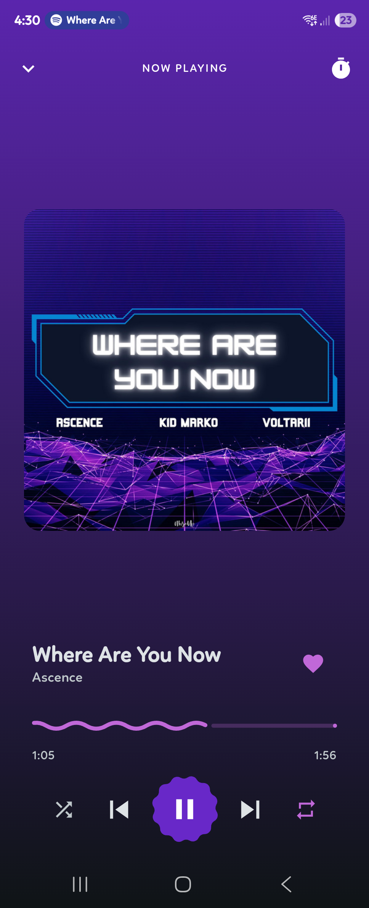
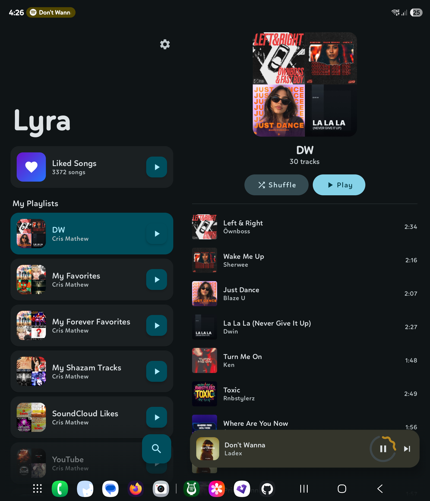
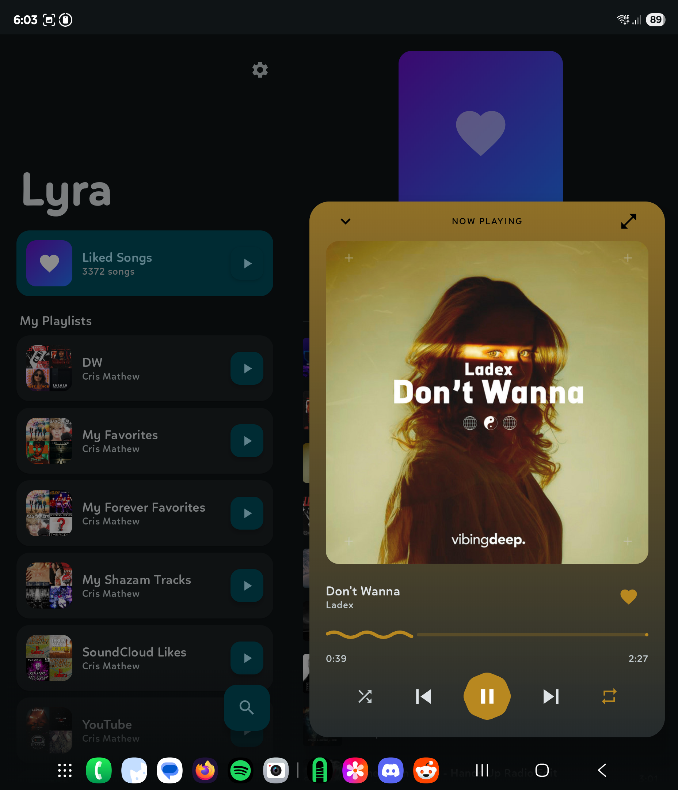

<div align="center">
  
  <h1>Lyra</h1>
  <p>A minimal Spotify client for Android with an adaptive layout for phones, foldables, and tablets.<br/>Lyra uses your own Spotify Developer credentials — no third-party servers, no data collection.</p>
</div>

---

## Features

- Library browser with playlist and liked songs support
- Full player with seek, shuffle, repeat, sleep timer, and queue-aware playback
- Synchronized lyrics — time-synced, auto-scrolling lyrics on the player screen (via LRCLIB), with a plain-text fallback when synced lyrics aren't available
- Audio visualizer — optional reactive visualizer that pulses behind the album art and along the bottom of other screens, coloured from the current album art
- Add to / remove from playlists directly from the player, or create a new playlist on the spot
- Spotify Connect device switching — transfer playback to any device on your account; "This device" card wakes Spotify locally when it isn't running
- Home-screen widget — resizable Now Playing widget with playback controls; its layout and artwork scale to the size you choose, and its colours are drawn from the current album art
- Album detail screen — full track list, play button, label/copyright footer
- Artist detail screen — discography grouped by Albums / Singles / Compilations
- Search for tracks, albums, and artists
- Open Spotify share links directly in Lyra (`open.spotify.com/track/…`, `/album/…`, `/artist/…`)
- Sleep timer with Live notification countdown on Android 16+
- Pull-to-refresh on both the library and track lists
- Adaptive two-pane layout for foldables and tablets
- Material 3 Expressive design — spring-based motion and seamless album-art transitions, with Material You dynamic colour and AMOLED black mode
- Tokens stored encrypted via AES-256-GCM (Android Keystore)

---

## Screenshots

### Single pane

<table>
  <tr>
    <td></td>
    <td></td>
    <td></td>
  </tr>
  <tr>
    <td></td>
    <td></td>
    <td></td>
  </tr>
</table>

### Dual pane

<table>
  <tr>
    <td></td>
    <td></td>
  </tr>
</table>

---

## Install

[](http://apps.obtainium.imranr.dev/redirect.html?r=obtainium://add/https://github.com/CrsMthw/Lyra)

Or download the latest APK from the [Releases](../../releases) page and install it directly on your device. You may need to allow installation from unknown sources in your Android settings.

Before launching, you need to register the app in the Spotify Developer Dashboard — this is a one-time step and takes about two minutes.

### 1. Create a Spotify Developer app

1. Go to [developer.spotify.com/dashboard](https://developer.spotify.com/dashboard)
2. Click **Create app**
3. Fill in any name and description — these are just for your dashboard
4. At the bottom, under **Which API/SDKs are you planning to use?**, check **Web API** and **Android**

### 2. Configure your app settings

In your app's **Settings**:

- Under **Redirect URIs**, add the following and save:
  ```
  com.crsmthw.lyra://callback
  ```
- Under **Android**, add:

  | Field | Value |
  |---|---|
  | Package name | `com.crsmthw.lyra` |
  | SHA-1 certificate fingerprint | `50530A2931B5B1595D1C991F92DA6644ABA6AFD6` |

### 3. Get your Client ID

From the dashboard overview, copy your **Client ID**. Enter it in the app on first launch — it is stored encrypted on-device and never leaves it.

---

## Building

### Prerequisites

- Android Studio Meerkat or later
- Android SDK 37 (compile), min SDK 35
- A free [Spotify Developer account](https://developer.spotify.com)
- The Spotify app installed on your device (required for App Remote playback)

Follow the Spotify Developer Dashboard Setup steps in the [Install](#install) section above. For debug builds, also add the SHA-1 of your local debug keystore (found via `./gradlew signingReport`) to the Android package settings in your Spotify app.

### 1. Get the Spotify App Remote SDK

The SDK is proprietary and cannot be redistributed, so it is not included in this repo.

1. Go to [github.com/spotify/android-sdk/releases](https://github.com/spotify/android-sdk/releases)
2. Download `spotify-app-remote-release-x.x.x.aar`
3. Place it in `app/libs/` and rename it to `spotify-app-remote-release-0.8.0.aar` (or update the filename in `app/build.gradle.kts` to match your downloaded version)

### 2. Build

Clone the repo, add the AAR as above, then open the root folder in Android Studio.

```bash
# Debug build
./gradlew assembleDebug

# Release build
./gradlew assembleRelease
```

---

## Architecture

```
app/src/main/java/com/crsmthw/lyra/
├── data/
│   ├── auth/        SpotifyAuthManager (OAuth 2.0 PKCE via AppAuth), TokenManager
│   ├── local/       EncryptedPrefs, LyraDataStore, LibraryCache
│   ├── remote/      SpotifyApiService (Retrofit), SpotifyRemoteManager (App Remote)
│   │   └── model/   Spotify API data models
│   └── repository/  SpotifyRepository, SettingsRepository
├── di/              AppContainer — manual DI, no Hilt
├── service/         LyraForegroundService (Now Playing + sleep timer notifications, widget controls)
├── ui/
│   ├── components/  MiniPlayer, PlayerCardContent, PlayerPopOutPanel, PlayerPanelHost,
│   │                TrackRow, PlaylistCard, AddToPlaylistSheet, DevicePickerSheet
│   ├── navigation/  LyraNavGraph, Screen
│   ├── screens/     auth / library / player / search / settings / album / artist / queue
│   └── theme/       Material You + static colour schemes, AMOLED overlay
├── util/            Extensions
└── widget/          Home-screen widget (Jetpack Glance)
```

**Auth**: PKCE via AppAuth — browser-based OAuth, no client secret ever stored.

**DI**: Manual `AppContainer` created in `LyraApplication`. No annotation processing.

**Playback**: Web API first; falls back to Spotify App Remote SDK on 404 (no active device). The SDK binds directly to the Spotify service via IPC, bypassing the Connect device requirement.

**Caching**: Coil disk cache (150 MB, survives system cache clears) for images. Gson-based JSON cache for library data with stale-while-revalidate refresh and per-playlist snapshot invalidation.

---

## Tech Stack

| Layer | Library |
|---|---|
| UI | Jetpack Compose + Material 3 Expressive (Material3 1.5.0-alpha21) |
| Navigation | Navigation Compose 2.9.8 |
| Auth | AppAuth 0.11.1 (PKCE) |
| Network | Retrofit 3.0.0 + OkHttp 5.3.2 |
| Images | Coil 3 |
| Widgets | Jetpack Glance |
| Secure storage | Android Keystore (AES-256-GCM) |
| Settings | DataStore Preferences |
| Build | AGP 9.2.1 · Kotlin 2.3.21 · KSP 2.3.8 |

---

## Credits

- **Lyrics** — [LRCLIB](https://github.com/tranxuanthang/lrclib), a free and open-source lyrics API
- **Visualizer** — visual style inspired by [Nier-Visualizer](https://github.com/bogerchan/Nier-Visualizer) and [NextGenVisualizer](https://github.com/jeffshee/NextGenVisualizer)
- **App icon** — designed by Shubbu

---

## License

MIT
